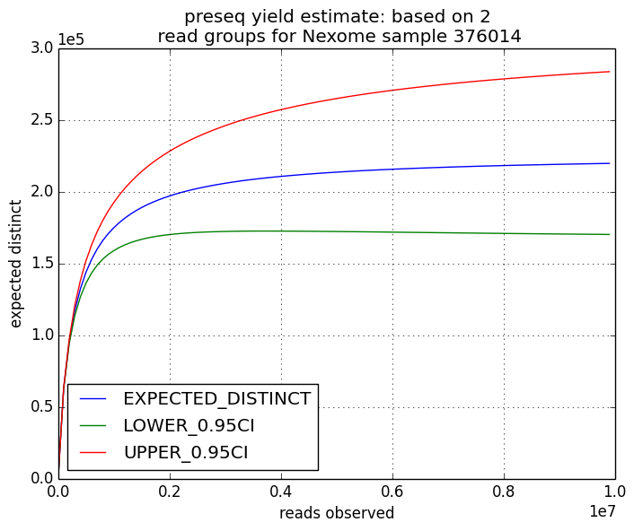
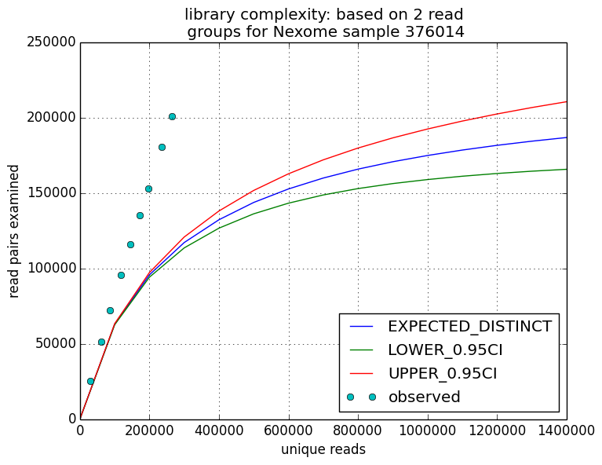
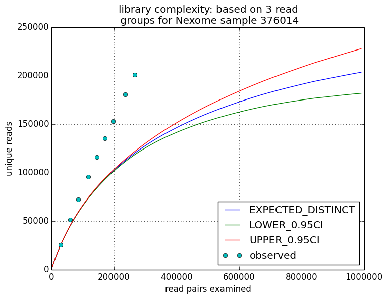
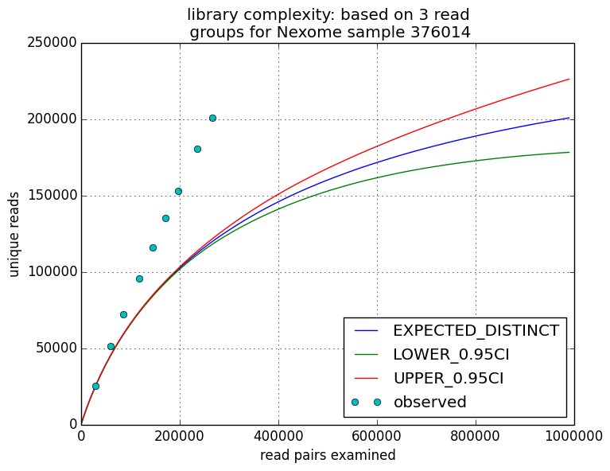

# parallel_preseq
parallelizing the preseq calculation for DNA sequencing.

# library size estimates & predicted yield curve from preseq:

yield curves for 3 read groups with Paired end read flag on:

and paired end read flag off:

*It seems strange that the predicted yeild curve got even the point for the input file wrong. Perhaps this command isn't being run correclty or on the right file.