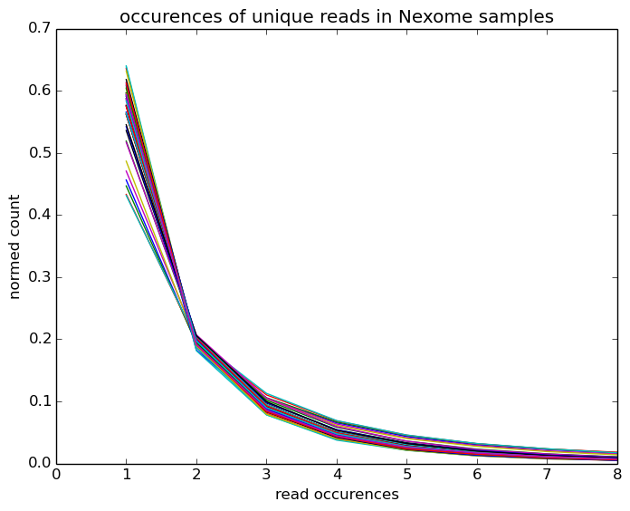

# parallel_preseq
parallelizing the preseq calculation for DNA sequencing.

# representative library size estimates & predicted yield curve from preseq:

preseq counts of unique molecules observed in Nexome samples:

